# Module 3.2 — Multi-Agent Workflows & Orchestration
## Trainer Visual Notes

> These diagrams are deliberately simple and presentation-friendly. They use Mermaid where a relational diagram helps, plus compact Markdown tables for comparison.

---

## 1. Single Agent → Multi-Agent

### Single Agent
One reasoning authority owns the complete goal and chooses among tools.

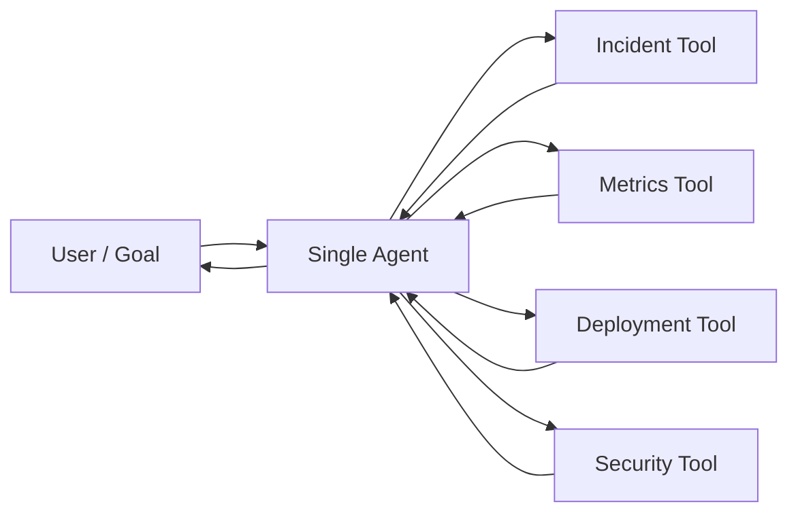

### Multi-Agent
Responsibility is decomposed across specialists.

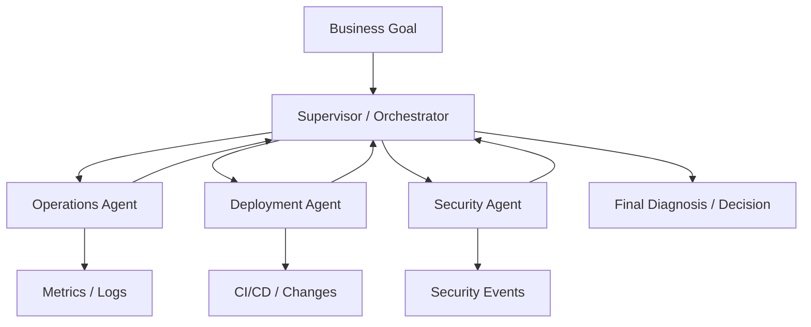

**Trainer point:** Multi-agent adds specialization, but also coordination, latency, state, cost and new failure modes.

---

## 2. Agent Specification — Define the Contract

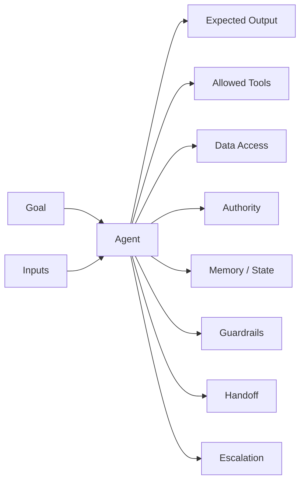

**Example — Deployment Agent**
- Goal: correlate deployments with incident symptoms.
- Can: read CI/CD history, compare timestamps, recommend rollback.
- Cannot: execute production rollback.
- Handoff: return evidence + confidence + recommendation to Incident Supervisor.

---

# 3. Topology Visuals

## 3.1 Hierarchical / Supervisor

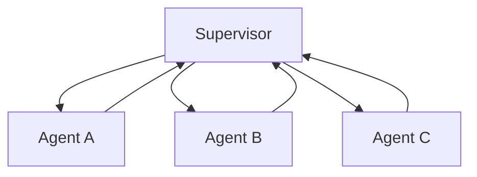

**Use when:** central accountability and controlled delegation matter.

---

## 3.2 Router + Specialists

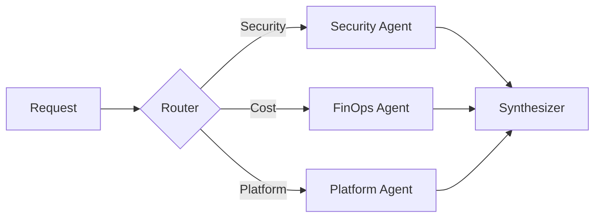

**Use when:** domains are clear but the required specialist varies by request.

---

## 3.3 Sequential Pipeline

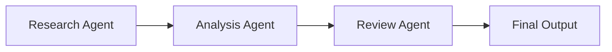

**Use when:** stages are ordered and each stage consumes the previous output.

**Risk:** an early error can propagate downstream.

---

## 3.4 Handoff

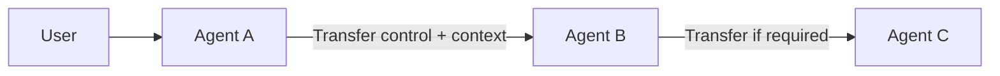

**Use when:** ownership changes as the interaction enters a different stage or domain.

---

## 3.5 Peer-to-Peer

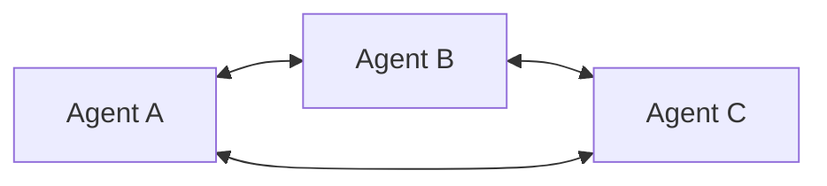

**Use when:** specialists need direct collaboration without a permanent central supervisor.

**Risk:** ownership, loops and global-state consistency.

---

## 3.6 Swarm / Dynamic Handoffs

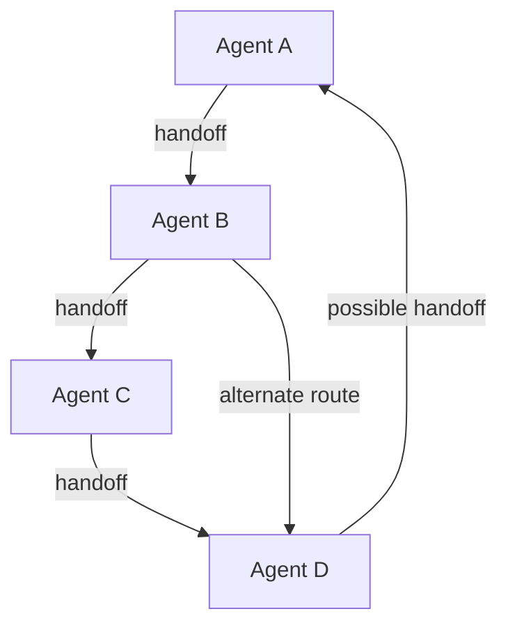

**Use when:** the appropriate next specialist emerges dynamically.

**Trainer warning:** flexibility rises, but predictability and governance fall.

---

## 3.7 Graph / State Machine

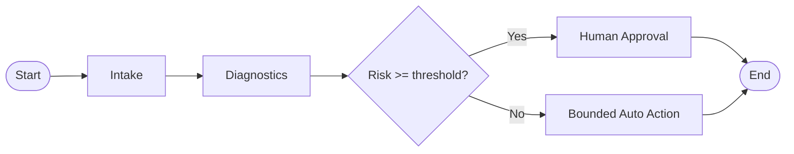

**Use when:** deterministic policy boundaries must surround agentic reasoning.

---

# 4. Static vs Dynamic Decomposition

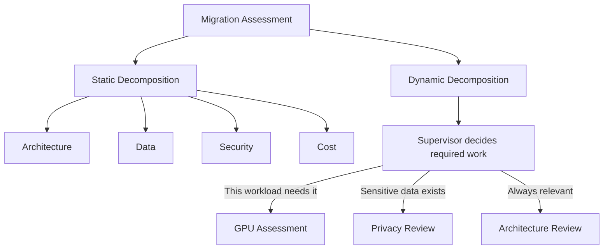

| Static | Dynamic |
|---|---|
| Tasks known in advance | Tasks selected at runtime |
| Predictable | Adaptive |
| Easier to test/audit | Handles ambiguity better |
| Less autonomous | More model-dependent |

---

# 5. Coordination & Shared State

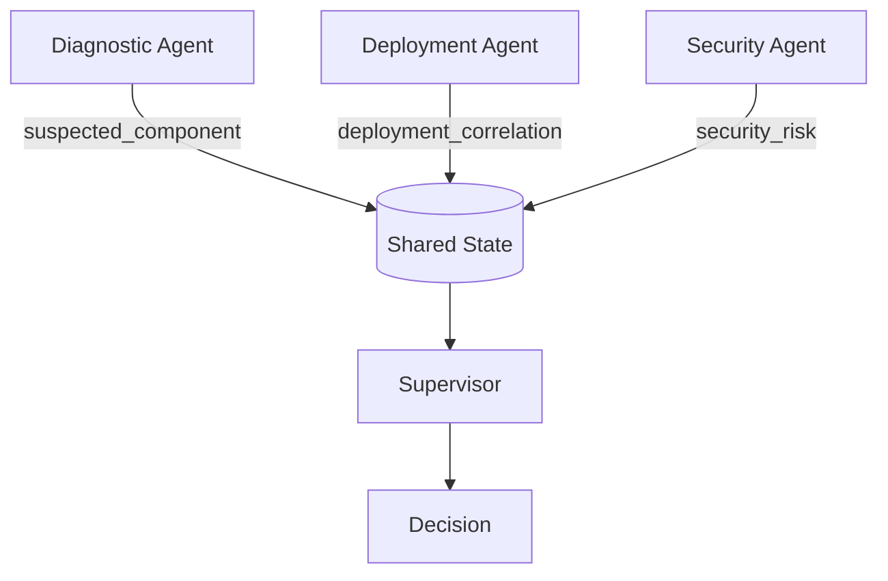

**Trainer point:** Shared state is not “dump the whole chat.” Define a schema and give each agent only the context it needs.

### Example state

```yaml
incident_id: INC-1042
affected_service: checkout-api
suspected_component: promotion-cache
deployment_correlation: high
security_risk: low
recommended_action: rollback-review
```

---

# 6. Negotiation / Conflicting Agents

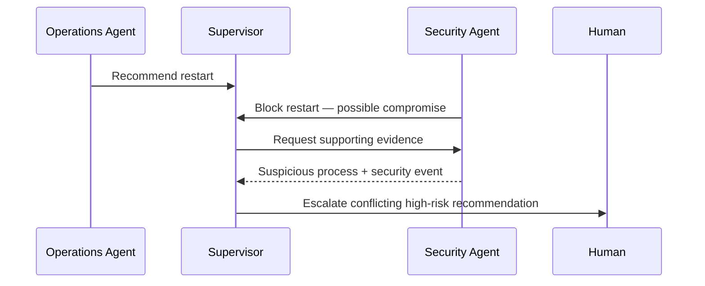

**Trainer point:** disagreement needs a resolution policy; “let the agents debate” is not automatically governance.

---

# 7. Cascading Failure

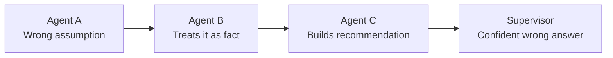

### Controls

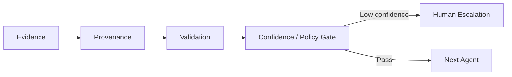

**Remember:** multi-agent systems combine distributed-system failures with probabilistic AI failures.

---

# 8. Multi-Agent Evaluation

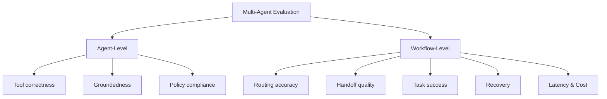

| Evaluate | Key question |
|---|---|
| Task success | Did the overall goal complete? |
| Routing | Was the correct specialist selected? |
| Handoff | Did the next agent receive enough context? |
| Groundedness | Are conclusions supported by evidence? |
| Policy | Did any agent exceed authority? |
| Recovery | What happened when an agent/tool failed? |
| Latency | Did orchestration become too slow? |
| Cost | How much model/tool-call amplification occurred? |

---

# 9. Framework Comparison

| Dimension | LangChain | LangGraph | AutoGen | CrewAI |
|---|---|---|---|---|
| Mental model | High-level agents/apps | Stateful graph/runtime | Conversational agent teams | Roles + tasks + crews/flows |
| Control flow | High-level / agent-driven | Explicit graph | Team/speaker driven | Process/flow driven |
| State | Agent/application state | First-class graph state | Conversation/team context | Crew/Flow state |
| Strong fit | Rapid agent composition | Production orchestration | Collaborative agent teams | Business-role workflows |
| Typical patterns | Subagents, router, handoff | Conditional graph, fan-out, cycles | RoundRobin, Selector, Swarm | Sequential, hierarchical, Flow |
| Deterministic boundaries | Medium | **High** | Medium | Medium–High with Flows |
| Best teaching message | Compose agents | Control orchestration | Let agents collaborate | Organize work around roles/tasks |

> Framework capabilities evolve. Use this as an architectural comparison, not a permanent product ranking.

---

# 10. Framework Pattern Map

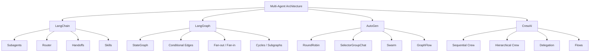

---

# 11. Framework Selection — Decision Visual

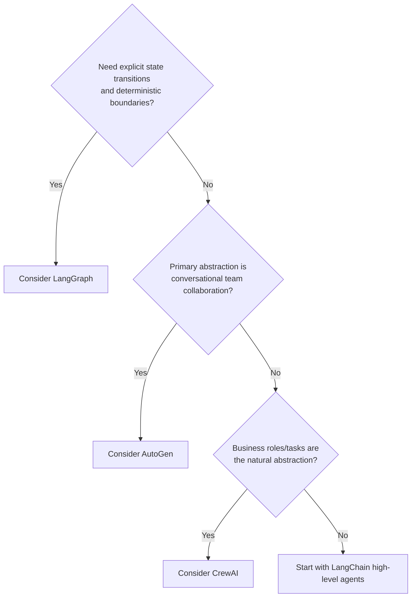

**Trainer caveat:** This is a teaching heuristic—not a product-selection rule. Real selection must include deployment, observability, state, HITL, ecosystem, skills and governance requirements.

---

# 12. Demo Progression

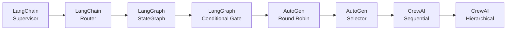

### What to ask after every demo

```text
Who owns the goal?
      ↓
Who owns state?
      ↓
Who chooses the next agent?
      ↓
What is deterministic?
      ↓
What terminates execution?
      ↓
Where is HITL?
      ↓
How does failure propagate?
      ↓
What did multi-agent cost us?
```

---

# 13. Final Architecture Message

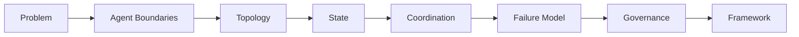

> **Do not start with the framework. Start with the architecture.**

And always finish with:

> **Did multi-agent materially improve the solution, or did we merely distribute one problem across more LLM calls?**
