# Capstone 1 — Enterprise API Modernization & Integration Discovery
## Architecture Decision Workbook — 4–6 Hour Team Capstone

> **Primary objective:** This is an architecture and decision-making exercise, not a coding competition. Your team will be evaluated on the quality of its decisions, trade-offs, risk thinking, integration design, governance, and ability to defend why one option was selected over another.

---

# 1. Business Situation & Problem Definition

**What we are doing:** Start by understanding the enterprise problem before choosing technologies. Your architecture should respond to business constraints and operational pain, not begin with a preferred framework or LLM.

A large enterprise has grown through acquisitions and now operates hundreds of APIs across legacy applications, microservices, SaaS platforms, partner integrations, and internally developed systems. Documentation quality varies: some APIs have current OpenAPI specifications, some have outdated documentation, and others are understood through source code, logs, support tickets, or tribal knowledge.

The enterprise wants to improve API discovery, reuse, dependency understanding, change-impact analysis, documentation, and governance without allowing AI-generated assumptions to become authoritative facts.

### Core Business Questions
- What APIs currently exist and what business capabilities do they provide?
- Which APIs appear to duplicate capabilities?
- Which applications consume each API and what dependencies exist?
- What may break when an API changes?
- Can an existing API satisfy a new requirement?
- Which APIs are poorly documented or potentially obsolete?
- Which information is authoritative and which information is inferred?
- Where can AI improve the process without becoming the source of truth?

---

# 2. Team Mission

**What we are doing:** Convert the broad problem into an architecture mission your team can defend. Decide what should be solved first, what remains outside scope, and what measurable success looks like.

Design an architecture and a small supporting prototype for an **Enterprise API Intelligence & Modernization Platform** that helps Integration Architects discover, understand, rationalize, govern, and safely evolve the API estate.

### Your team must decide
- Which capabilities are essential for Phase 1?
- Which capabilities can wait?
- Where should deterministic software be used?
- Where is semantic/AI reasoning useful?
- Where, if anywhere, are agents justified?
- What information becomes the source of truth?
- What decisions require human approval?
- How will the architecture scale beyond the classroom prototype?

---

# 3. Stakeholder Discovery

**What we are doing:** Architecture decisions affect different stakeholders differently. Identify who owns information, who approves risk, who operates the platform, and who consumes its recommendations.

| Stakeholder | Primary Need | Decisions They Own | Data They Can Access | Major Concern | Priority |
|---|---|---|---|---|---|
| Integration Architect | | | | | |
| API Developer | | | | | |
| Application Owner | | | | | |
| Security Team | | | | | |
| Compliance / Risk | | | | | |
| Platform / DevOps | | | | | |
| Operations / Support | | | | | |
| Business/Product Owner | | | | | |

### Questions to answer
1. Who owns authoritative API metadata?
2. Who may declare two APIs duplicates?
3. Who approves API retirement?
4. Who decides whether inferred dependencies are trustworthy?
5. Who authorizes access to sensitive API documentation?
6. Who owns incidents caused by an incorrect recommendation?

---

# 4. Requirements, Constraints & Assumptions

**What we are doing:** Separate known facts from assumptions before designing. Good architecture makes uncertainty explicit rather than silently converting assumptions into design facts.

Create at least ten requirements and classify them.

| ID | Requirement / Constraint | Functional / NFR / Compliance | Must / Should / Could | Known or Assumed? | Owner | Architecture Impact |
|---|---|---|---|---|---|---|
| R1 | | | | | | |
| R2 | | | | | | |
| R3 | | | | | | |
| R4 | | | | | | |
| R5 | | | | | | |
| R6 | | | | | | |
| R7 | | | | | | |
| R8 | | | | | | |
| R9 | | | | | | |
| R10 | | | | | | |

Consider availability, latency, scale, API inventory size, security, auditability, data residency, recoverability, maintainability, explainability, and cost.

---

# 5. Prioritise the Architecture Decisions

**What we are doing:** Decide the order in which architectural uncertainty should be reduced. A late compliance, ownership, or data-residency discovery can invalidate many earlier technology choices.

Rank from **1 = resolve first** to **10 = resolve later** and defend your sequence.

| Architecture Decision | Your Rank | Why at this position? | What depends on it? |
|---|---:|---|---|
| Business outcome / success criteria | | | |
| Compliance & data residency | | | |
| Source of truth | | | |
| Integration contracts | | | |
| Data architecture | | | |
| AI vs deterministic boundary | | | |
| Security / identity | | | |
| Technology/framework selection | | | |
| Deployment architecture | | | |
| UI / prototype implementation | | | |

**Team challenge:** Explain why your #1 must happen before #2 and why your final decision can safely wait.

---

# 6. Capability Prioritisation

**What we are doing:** Avoid designing an oversized platform by deciding which capabilities create value first. Consider business value, architectural dependency, risk, cost, and implementation complexity.

| Capability | Business Value | Complexity | Risk | Phase 1 / 2 / Later | Why? |
|---|---|---|---|---|---|
| API inventory | | | | | |
| OpenAPI ingestion | | | | | |
| Legacy API discovery | | | | | |
| Semantic API search | | | | | |
| API recommendation | | | | | |
| Duplicate detection | | | | | |
| Dependency mapping | | | | | |
| Change-impact analysis | | | | | |
| Documentation generation | | | | | |
| API quality scoring | | | | | |
| Retirement recommendation | | | | | |
| Governance workflow | | | | | |

---

# 7. Technology Decision Matrix

**What we are doing:** Select technology only after the problem and constraints are understood. Every major choice requires alternatives, justification, risks, and an explanation of why rejected options were not selected.

> **“None” is a valid architectural choice.** Do not add LangChain, Kafka, vector databases, Kubernetes, or agents merely because they appeared in training.

| Decision | Options Considered | Selected Option | Why Selected? | Why Alternatives Rejected? | Risk / Trade-off |
|---|---|---|---|---|---|
| Programming language | Python / Java / Other | | | | |
| API framework | FastAPI / Spring Boot / Other / None | | | | |
| Agent framework | LangGraph / LangChain / AutoGen / Plain Python / None | | | | |
| Operational database | PostgreSQL / MongoDB / Other | | | | |
| Vector storage | pgvector / Qdrant / managed / None | | | | |
| Dependency store | Graph DB / relational / search index / files / None | | | | |
| Search | Keyword / semantic / hybrid | | | | |
| Messaging | Kafka / queue / PubSub / None | | | | |
| LLM provider | Hosted / private / local / multi-provider / None | | | | |
| API / AI gateway | Kong / existing gateway / direct / other | | | | |
| Authentication | | | | | |
| Secrets management | | | | | |
| Observability | | | | | |
| Deployment | VM / containers / Kubernetes / serverless / hybrid | | | | |

**Mandatory defence:** For every major technology, answer: **What requirement made this technology necessary?**

---

# 8. Integration Architecture

**What we are doing:** Design how existing enterprise systems, specifications, repositories, catalogs, telemetry, and the proposed platform exchange information. Focus on contracts, ownership, synchronisation, failure handling, and authoritative data.

Potential sources include OpenAPI specifications, source repositories, API gateways, API catalogs, CMDB, service registries, runtime logs, traces, documentation, support tickets, and CI/CD metadata.

| Integration | Source | Destination | Sync / Async / Batch | Contract | Frequency | Failure Strategy | Why? |
|---|---|---|---|---|---|---|---|
| | | | | | | | |
| | | | | | | | |
| | | | | | | | |
| | | | | | | | |

### Questions to answer
- Which systems are authoritative?
- Push or pull?
- Event-driven or scheduled ingestion?
- How are schema changes handled?
- How are duplicates reconciled?
- How are failed ingestion jobs replayed?
- How is lineage preserved?

---

# 9. Data Architecture

**What we are doing:** Decide what data the platform needs and how structured, unstructured, semantic, and relationship data should be represented. Do not select a vector or graph database until you can identify the query it solves.

| Data | Example | System of Record | Proposed Storage | Retention | Sensitive? | Why This Storage? |
|---|---|---|---|---|---|---|
| API metadata | | | | | | |
| OpenAPI specifications | | | | | | |
| Documentation | | | | | | |
| Embeddings | | | | | | |
| Dependencies | | | | | | |
| Usage / telemetry | | | | | | |
| AI recommendations | | | | | | |
| Human approvals | | | | | | |

### Mandatory questions
1. Do you actually need a vector database?
2. Do you actually need a graph database?
3. What is the authoritative API record?
4. Which data can be regenerated?
5. Which data must be retained for audit?
6. What happens when AI-derived metadata conflicts with authoritative metadata?

---

# 10. AI vs Deterministic vs Agent vs Human

**What we are doing:** Decide where intelligence genuinely improves the architecture and where conventional software is safer. AI must have a specific job rather than being inserted into every component.

| Capability | Deterministic Code | LLM | Agent | Human | Final Choice | Why? |
|---|---:|---:|---:|---:|---|---|
| Parse OpenAPI | | | | | | |
| Extract metadata | | | | | | |
| Semantic discovery | | | | | | |
| Dependency identification | | | | | | |
| Duplicate detection | | | | | | |
| Change-impact analysis | | | | | | |
| API recommendation | | | | | | |
| Documentation generation | | | | | | |
| API retirement | | | | | | |
| Production change | | | | | | |

**Critical question:** What would materially become worse if AI were removed tomorrow? If the answer is unclear, reconsider whether AI belongs there.

---

# 11. Prompting vs RAG vs Fine-Tuning vs Tools

**What we are doing:** Choose the mechanism that fits each AI requirement rather than assuming every problem needs RAG or fine-tuning. Connect the technique to whether the problem is missing knowledge, missing behaviour, external action, or deterministic logic.

```text
Requirement
    |
    +-- Exact deterministic result? → Conventional code / rules
    +-- Current enterprise knowledge? → RAG / APIs / tools
    +-- External action/data? → Tool calling
    +-- Behaviour achievable with instructions/examples? → Prompting / few-shot
    +-- Repeated specialised behaviour still inadequate? → Evaluate fine-tuning
```

| Requirement | Prompt | RAG | Tool/API | Fine-Tune | Conventional Code | Why? |
|---|---:|---:|---:|---:|---:|---|
| API search | | | | | | |
| API classification | | | | | | |
| Dependency analysis | | | | | | |
| Documentation | | | | | | |
| Recommendation | | | | | | |

---

# 12. Fine-Tuning Decision Gate

**What we are doing:** Fine-tuning creates an additional data, evaluation, governance, and model-lifecycle problem. Select it only when the team can demonstrate why prompting, retrieval, tools, and deterministic logic are insufficient.

If the answer is **NO fine-tuning**, document why. If **YES**, design the pipeline below.

```mermaid
flowchart LR
 A[Source Data] --> B[Rights / PII / Compliance]
 B --> C[Quality & Deduplication]
 C --> D[Dataset Preparation]
 D --> E[Train / Validation / Test]
 E --> F[Fine-Tuning]
 F --> G[Evaluation]
 G --> H[Model Registry / Version]
 H --> I[Deployment]
 I --> J[Monitoring]
 J --> K[Feedback / Retraining]
```



| Decision | Your Answer | Alternatives Considered | Evidence / Reason |
|---|---|---|---|
| Why fine-tune? | | | |
| Training-data source | | | |
| Data rights | | | |
| PII handling | | | |
| Dataset quality | | | |
| Evaluation dataset | | | |
| Base model | | | |
| Training method | | | |
| Model versioning | | | |
| Rollback | | | |
| Retraining trigger | | | |

---

# 13. Agent Architecture Decision

**What we are doing:** Decide whether this is genuinely an agentic problem or simply an application with LLM calls. If agents are selected, justify autonomy, tools, state, orchestration, permissions, budgets, and failure boundaries.

Consider Plain Python, a single LLM call, tool-calling agent, deterministic workflow with selected AI steps, single orchestrator, supervisor–worker, or multi-agent architecture.

| Question | Team Decision | Why? |
|---|---|---|
| Do we need an agent at all? | | |
| Why LangGraph/LangChain/AutoGen/plain Python? | | |
| What tools may the agent call? | | |
| What state must persist? | | |
| What actions are read-only? | | |
| What actions require approval? | | |
| What actions are prohibited? | | |
| How are loops/budgets bounded? | | |
| What happens when the agent fails? | | |

---

# 14. Required Architecture Views

**What we are doing:** Describe the solution from multiple perspectives instead of relying on one overloaded diagram. Each view should answer a different class of questions for architects, security, operations, developers, and business stakeholders.

Your team must produce:

1. **System Context Diagram** — users, external systems, enterprise boundary and proposed platform.
2. **Logical Component Architecture** — major components and responsibilities.
3. **Integration & Data Flow** — how information enters, moves, transforms and leaves.
4. **AI / Agent Architecture** — LLMs, agents, tools, RAG, prompts, model gateway and deterministic components.
5. **Security & Trust Boundary Diagram** — identities, sensitive data, secrets, external providers and approval points.
6. **Deployment Architecture** — VM/container/Kubernetes/SaaS/databases/model endpoints and network boundaries.
7. **Model / RAG / Fine-Tuning Flow** — required if these techniques are used.

---

# 15. Security, Privacy & Compliance

**What we are doing:** Test whether the design survives enterprise security review before significant implementation effort. Identify enforceable controls and ownership rather than relying on prompts as security boundaries.

| Concern | Relevant? | Risk | Control | Owner | Must Resolve Before Build? |
|---|---:|---|---|---|---:|
| PII | | | | | |
| Confidential API documentation | | | | | |
| Credentials / secrets | | | | | |
| Data residency | | | | | |
| Model-provider data usage | | | | | |
| Prompt injection | | | | | |
| RAG authorization | | | | | |
| Unauthorized tool calls | | | | | |
| Audit trail | | | | | |
| Retention / deletion | | | | | |

Identify the **three security/compliance decisions that could invalidate your architecture** if discovered too late.

1. ______________________________
2. ______________________________
3. ______________________________

---

# 16. Human Authority & Approval Matrix

**What we are doing:** Define who may recommend, approve, reject, and execute high-impact decisions. Human oversight should be placed at risk boundaries rather than indiscriminately inserted into every step.

| Decision / Event | AI | Developer | Architect | Business | Security / Compliance | Operations | Final Authority |
|---|---|---|---|---|---|---|---|
| Architecture approval | | | | | | | |
| Data access | | | | | | | |
| API contract change | | | | | | | |
| Duplicate classification | | | | | | | |
| API retirement | | | | | | | |
| Model selection | | | | | | | |
| Production remediation | | | | | | | |

---

# 17. Failure & Resilience Architecture

**What we are doing:** Design for conditions under which dependencies, AI components, pipelines, or assumptions fail. A production architecture must describe degraded behaviour, recovery, escalation, and business continuity.

| Failure Scenario | Detection | System Behaviour | Recovery | Human Escalation | Business Impact |
|---|---|---|---|---|---|
| LLM unavailable | | | | | |
| Vector store unavailable | | | | | |
| API catalog unavailable | | | | | |
| Bad OpenAPI input | | | | | |
| Model hallucination | | | | | |
| Prompt injection in documentation | | | | | |
| Wrong duplicate recommendation | | | | | |
| Credential compromise | | | | | |
| LLM latency >20 sec | | | | | |
| AI cost increases 10× | | | | | |

**Mandatory question:** What useful capability remains available when the LLM is completely unavailable?

---

# 18. Observability & Evaluation

**What we are doing:** Define how the team knows whether both conventional software and AI components are behaving correctly after deployment. AI quality requires evaluation signals in addition to infrastructure monitoring.

| Metric | Why It Matters | Target / Threshold | Measurement Method | Owner |
|---|---|---|---|---|
| API search accuracy | | | | |
| Recommendation precision | | | | |
| False duplicate rate | | | | |
| Response latency | | | | |
| LLM/token cost | | | | |
| Tool failure rate | | | | |
| Human rejection rate | | | | |
| API reuse improvement | | | | |
| Time saved | | | | |

---

# 19. Deployment & Operational Readiness

**What we are doing:** Think beyond a successful prototype and decide how the platform will be deployed, upgraded, secured, observed, rolled back, and supported. The objective is to expose operational consequences of architecture decisions.

Answer:
- Where does each component run?
- What is managed vs self-hosted?
- How are environments separated?
- How are secrets supplied?
- How is configuration versioned?
- How are prompts/specifications versioned?
- How is the model version controlled?
- How is rollback performed?
- How are database migrations handled?
- Who receives alerts?
- What are expected RTO/RPO?
- How will cost be controlled?

---

# 20. Prototype Scope

**What we are doing:** Build only enough code to validate the riskiest architectural assumption. The prototype is evidence supporting the architecture; it is not the primary deliverable.

Choose only one or two capabilities, such as ingesting five OpenAPI specs, semantic discovery, dependency lookup, duplicate/reuse recommendation, change-impact explanation, or a small API catalog assistant.

| Question | Team Answer |
|---|---|
| What hypothesis are we testing? | |
| What will we build? | |
| What will we deliberately NOT build? | |
| What data will we use? | |
| What constitutes success? | |
| What result would invalidate our design? | |

---

# 21. Business Value & ROI

**What we are doing:** Connect technical architecture to measurable enterprise outcomes. A technically elegant platform without measurable value or acceptable operating cost is not automatically a good architecture.

```text
AI VALUE = Useful Work Improved - Human Rework - Inference/Tool Cost - Operational Failure Cost - Risk Exposure
```

| Business Metric | Current State | Target State | How Architecture Helps | How Measured |
|---|---|---|---|---|
| API discovery time | | | | |
| API reuse rate | | | | |
| Duplicate APIs | | | | |
| Change-impact analysis time | | | | |
| Documentation effort | | | | |
| Production defects | | | | |

---

# 22. Architecture Decision Records — ADRs

**What we are doing:** Capture important decisions so future teams understand not only what was chosen but why. ADRs preserve decision context and identify the conditions under which a choice should be revisited.

Create at least **five ADRs**.

```text
ADR-001: <Decision Title>

Context:
What problem forced this decision?

Options:
A.
B.
C.

Decision:
What did the team select?

Why:
Why is this best under current constraints?

Rejected Alternatives:
Why were they rejected?

Consequences:
What benefits and disadvantages result?

Revisit When:
What future condition should trigger reconsideration?
```

Suggested ADRs: source of truth; database/data architecture; AI vs deterministic boundary; agent/framework decision; deployment/model-provider decision.

---

# 23. Final Architecture Review Checklist

**What we are doing:** Perform a self-review before presenting to the Architecture Review Board. This checklist is intended to expose missing decisions, unjustified technologies, and risks hidden by an attractive diagram or prototype.

### Problem & Value
- [ ] We can state the business problem in two sentences.
- [ ] We identified measurable success criteria.
- [ ] We prioritised capabilities rather than attempting everything.

### Architecture
- [ ] Every major component has a clear responsibility.
- [ ] Every major technology has a requirement-based justification.
- [ ] We identified authoritative systems of record.
- [ ] We documented integration contracts.
- [ ] We considered failure and recovery.

### AI
- [ ] We explained exactly why AI is needed.
- [ ] We separated deterministic logic from probabilistic reasoning.
- [ ] We justified RAG / prompting / tools / fine-tuning choices.
- [ ] We justified whether agents are necessary.
- [ ] AI recommendations are distinguishable from authoritative facts.

### Data
- [ ] We know where data originates and where it is stored.
- [ ] We understand lineage and retention.
- [ ] We justified vector/graph storage if used.
- [ ] We designed a fine-tuning data pipeline if fine-tuning is used.

### Security & Governance
- [ ] Identity and authorization are defined.
- [ ] Secrets are managed outside prompts/source code.
- [ ] PII/confidential data is identified.
- [ ] Human approval boundaries are defined.
- [ ] Audit requirements are defined.
- [ ] Prompt-injection/RAG risks are considered.

### Operations
- [ ] Deployment architecture exists.
- [ ] Observability exists.
- [ ] Rollback exists.
- [ ] Cost controls exist.
- [ ] LLM-unavailable behaviour is defined.

### Decision Quality
- [ ] At least five ADRs are documented.
- [ ] Rejected alternatives are recorded.
- [ ] We know which decision is hardest to reverse.
- [ ] We know which assumption presents the greatest risk.

---

# 24. Final Team Submission

**What we are doing:** Consolidate the team's reasoning into a compact architecture package that can be reviewed and challenged. Decisions should be traceable from the business problem through technology, security, deployment, and operations.

Submit:
1. Problem statement and assumptions
2. Stakeholder matrix
3. Requirements/priorities
4. Capability prioritisation
5. Technology decision matrix
6. System Context Diagram
7. Logical Architecture
8. Integration/Data Flow
9. AI/Agent Architecture
10. Security/Trust Boundaries
11. Deployment Architecture
12. AI vs deterministic matrix
13. RAG/fine-tuning decision
14. Failure/resilience matrix
15. Human authority matrix
16. Five ADRs
17. Small prototype
18. Business value/ROI
19. Final review checklist

---

# 25. Architecture Review Board — Team Defence

**What we are doing:** Defend the architecture as if presenting to senior architects, security, operations, and business stakeholders. The quality of reasoning matters more than whether a reviewer personally prefers your selected technology.

Be prepared to answer:
1. Why this database and not the alternatives?
2. Why this programming language?
3. Why LangGraph/LangChain/AutoGen/plain Python — or why no agent framework?
4. Why an agent instead of deterministic orchestration?
5. Why RAG instead of fine-tuning?
6. If fine-tuning is selected, where does training data come from?
7. Why eventing instead of synchronous APIs — or vice versa?
8. Where is confidential information stored?
9. What is the source of truth?
10. What happens when the LLM is wrong?
11. What happens when the LLM is unavailable?
12. Who can approve a production-impacting action?
13. Which decision is most expensive to reverse?
14. Which assumption worries you most?
15. What would you build first?
16. If budget is cut by 50%, what disappears?
17. If the system must handle 100× more APIs, what changes?
18. If regulations prohibit sending API docs to an external model, what changes?
19. What becomes worse if AI is removed?
20. What part would you refuse to deploy today, and why?

---

# 26. Suggested 4–6 Hour Team Plan

**What we are doing:** Time-box the exercise so architecture thinking receives substantially more time than coding. Teams may adjust the sequence, but implementation should not consume the majority of the capstone.

| Time | Activity |
|---|---|
| 0:00–0:30 | Problem understanding, stakeholders, assumptions |
| 0:30–1:15 | Requirements, priorities, capability decisions |
| 1:15–2:15 | Technology, integration and data decisions |
| 2:15–3:00 | AI/agent/RAG/fine-tuning decisions |
| 3:00–3:45 | Security, compliance, resilience and human authority |
| 3:45–4:30 | Architecture diagrams + ADRs |
| 4:30–5:15 | Small prototype / validation experiment |
| 5:15–5:45 | ROI, operational readiness, checklist |
| 5:45–6:00 | Architecture Review Board preparation |

For a four-hour capstone, reduce prototype time and combine review activities rather than removing architecture decisions.

---

# 27. Evaluation Model

**What we are doing:** Make clear that teams are rewarded for architectural reasoning rather than code volume. A small prototype with excellent trade-off analysis should outperform a sophisticated demo built on weak architectural assumptions.

| Evaluation Area | Weight |
|---|---:|
| Problem framing & stakeholder understanding | 10% |
| Architecture decisions & trade-offs | 25% |
| Architecture quality | 20% |
| Integration & data architecture | 15% |
| AI / agent decision quality | 10% |
| Security, compliance & governance | 10% |
| Prototype / validation evidence | 5% |
| Business value & architecture defence | 5% |

---

# Final Instruction to Participants

**What we are doing:** The capstone simulates the ambiguity and trade-offs of real enterprise architecture work. Your goal is not to maximise technologies or code, but to produce a defensible chain of decisions from business need to an operable solution.

> **Do not try to impress the review board with the number of technologies, agents, models, or lines of code in your solution.**

```text
Business
   ↓
People
   ↓
Risk & Compliance
   ↓
Requirements
   ↓
Data
   ↓
Integration
   ↓
AI vs Non-AI
   ↓
Technology
   ↓
Security
   ↓
Deployment
   ↓
Operations
   ↓
Business Value
```

> **The prototype proves selected assumptions. The architecture and the reasoning behind it are the real capstone.**
